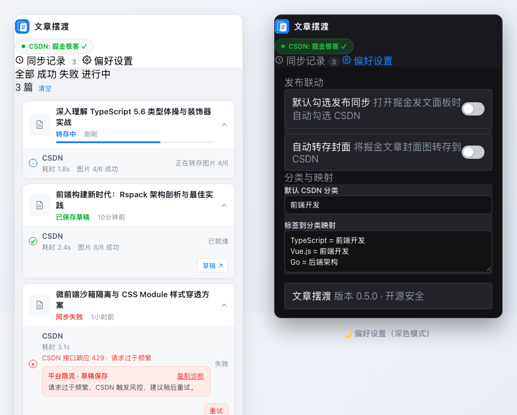

<div align="center">
  
  <h1>🚀 文章摆渡 (Article Ferry)</h1>
  <p><b>面向技术创作者的轻量、端侧安全内容同步工具 · 把掘金文章可靠地摆渡到 CSDN 草稿箱</b></p>

  [](https://github.com/Xxcool/juejin-csdn-extension/actions/workflows/ci.yml)
  [](https://github.com/Xxcool/juejin-csdn-extension/releases)
  [](LICENSE)
</div>

---

## 📸 界面预览 (Preview)

<div align="center">
  
  <p><i>▲ v0.5.0 扁平化双 Tab 仪表盘（浅色模式实时任务进度与一键诊断复制 / 深色模式偏好设置）</i></p>
</div>

---

## 📖 项目简介

**「文章摆渡」** 是一款基于 Chrome Manifest V3 规范打造的去中心化创作者扩展。它以掘金为首要创作入口，在创作者明确选择后，将新发布或历史文章可靠地同步至 CSDN 草稿箱。

> [!IMPORTANT]
> **人机协作与安全原则 (Human-in-the-loop)**：  
> 插件**坚决不替用户公开发布**文章。工具专注消灭 90% 的机械搬运、格式清洗与图床转存工作，标题、分类、标签及最终发布确认权永远保留在目标平台草稿箱，严格敬畏平台规则。

---

## ✨ 核心特性

- 🚀 **发布无感联动**：在掘金发文面板点击“确定并发布”时，后台即刻启动 CSDN 草稿同步，不阻塞掘金正常审核与发布流程。
- 📜 **历史博文迁移**：在掘金创作者文章列表中，一键将已发布文章完整迁移至 CSDN 草稿箱。
- 🖼️ **外链自动转存**：正文外链与封面图自动转存至 CSDN CDN，规避防盗链失效风险；采用 3 路限流并发与指数退避重试。
- 📝 **智能草稿幂等**：基于 `article_id` 与 `draft_id` 双重映射，再次同步同一篇文章时自动更新已有草稿，避免重复生成垃圾草稿。
- 🎨 **现代双 Tab 仪表盘**：重构为扁平化仪表盘（同步记录 / 偏好设置），顶栏实时展示 CSDN 账号状态胶囊。
- 🌓 **自适应深色模式**：Design Tokens 规范驱动，全面支持深色模式（Dark Mode），夜间写作视觉柔和。
- 🩺 **结构化脱敏诊断**：失败任务清晰归因（登录失效 / 平台限流 / 内容异常 / 网络超时），支持一键复制脱敏诊断日志。
- ♿ **无障碍友好设计**：完整遵循 WAI-ARIA 语义，支持键盘快捷键（左右箭头键平滑轮转 Tab，Tab 键聚焦操作）。

---

## 🛡️ 可靠性与安全架构

<div align="center">
  
  <p><i>▲ 端到端处理管线：从用户明确触发到草稿安全落地的每一步均具备失败隔离与状态出口</i></p>
</div>

* **零 Cookie 读取**：不申请 `cookies` 权限，不截获、不导出、不中转用户账号凭据，直接复用当前浏览器现有会话。
* **去中心化端侧处理**：所有清洗、渲染与网络请求均在本地浏览器环境内闭环执行，不经由任何第三方代理服务器。
* **Service Worker 崩溃自愈**：后台异常中断或浏览器重启后，能够可靠恢复未完成的同步任务队列。
* **优雅失败降级**：个别正文图片转存失败时自动保留原始链接继续推进，避免整篇文章因此中断。

---

## 🚀 快速上手与安装

### 📥 方式一：从 GitHub Release 安装（推荐）

1. 前往 [Releases 发行页](https://github.com/Xxcool/juejin-csdn-extension/releases) 下载最新的 `article-ferry-v*.zip`；
2. 解压 ZIP 压缩包；
3. 打开 Chrome 浏览器，地址栏输入并访问 `chrome://extensions`；
4. 开启页面右上角的**“开发者模式”**；
5. 点击左上角**“加载已解压的扩展程序”**，选择解压出来的目录；
6. 在同一浏览器中分别登录掘金与 CSDN，点击扩展图标即可开始使用。

> [!NOTE]
> GitHub 离线安装版不会自动静默更新。当有新版本发布时，重新下载最新 ZIP 解压并点击扩展卡片的“刷新”按钮即可平滑升级。

### 🛠️ 方式二：从源码构建与开发

要求 **Node.js 20+**：

```bash
# 1. 克隆代码仓库
git clone https://github.com/Xxcool/juejin-csdn-extension.git
cd juejin-csdn-extension

# 2. 安装依赖并执行类型检查
npm install
npm run check

# 3. 运行自动化测试 (22 项测试全通)
npm test

# 4. 构建扩展生产产物
npm run build
```

构建完成后，在 `chrome://extensions` 中加载生成的 `dist/` 目录即可。

---

## 🎯 使用指南

### 📝 1. 同步新撰写文章
1. 在掘金编辑器中撰写并完成文章；
2. 点击右上角“发布”，在弹出的发布设置面板中勾选 **“同步到 CSDN 草稿”**；
3. 正常点击“确定并发布”，掘金发文与 CSDN 草稿同步将在后台各自异步执行，互不干扰；
4. 在扩展弹窗的“同步记录”中随时查看处理进度，点击 **“草稿 ↗”** 即可直达 CSDN 编辑器完成最终确认。

### 📜 2. 同步本人历史文章
1. 进入掘金创作者中心的 [文章管理列表](https://juejin.cn/creator/content/article)；
2. 找到目标文章，点击操作栏右侧的“更多”菜单（三个点）；
3. 点击 **“同步到 CSDN”**；
4. 若尚未登录 CSDN，扩展顶栏胶囊会提示登录，登录完成后返回页面即可一键继续同步。

---

## 🔒 权限与隐私声明

| 权限声明 / 请求域 | 核心用途 |
| :--- | :--- |
| `storage` | 在本地浏览器保存用户的同步偏好设置与任务状态记录（不上传云端） |
| `declarativeNetRequestWithHostAccess` | 仅为必要的掘金/CSDN 官方接口补充 Web 客户端必需的校验请求头 |
| `juejin.cn` / `api.juejin.cn` | 注入发文同步控件，并拉取创作者主动选择同步的文章内容 |
| 掘金图片 CDN 域 | 下载正文与封面高清图片以便转存至目标平台 |
| `bizapi.csdn.net` | 检查创作者 CSDN 登录在线状态、获取上传凭证及保存草稿 |
| CSDN 图片存储服务 | 将转存后的图片流安全写入创作者个人的 CSDN 空间 |

> 详情可参阅完整的 [隐私权说明](PRIVACY.md) 与 [安全防御政策](SECURITY.md)。

---

## ⚙️ 技术架构与实现

```text
┌─────────────────────────┐
│     掘金页面原生集成     │  (MAIN World 隔离桥接脚本 · 读取标题/Markdown/ID)
└────────────┬────────────┘
             │ chrome.runtime.sendMessage
┌────────────▼────────────┐
│    后台异步协调器引擎     │  (MV3 Service Worker · 任务队列/状态持久化/断点自愈)
└────────────┬────────────┘
             │ 管道流转
┌────────────▼────────────┐
│      内容清洗与转存      │  (GFM 围栏规范化 · 图片 3 路并发转存 · 防盗链清洗)
└────────────┬────────────┘
             │ 签名协议调用
┌────────────▼────────────┐
│     CSDN Web 适配器     │  (安全鉴权 · 保存至草稿箱 · 返回可交互草稿直达链接)
└─────────────────────────┘
```

---

## ⚠️ 已知限制

1. **平台方向**：当前仅支持“掘金 $\rightarrow$ CSDN”单向同步（多平台如博客园支持已列入演进规划）；
2. **草稿箱保存**：为了您的账号安全与发文合规，本插件**绝不提供自动一键公开发布功能**；
3. **接口契约**：依赖目标平台的 Web 接口规范，若平台改版可能会提示“平台接口异常”，通常会在 24 小时内跟进适配。

---

## 🤝 参与贡献

热烈欢迎提交 Issue 与 Pull Request！
- 开发前请先阅读 [贡献指南 (CONTRIBUTING.md)](CONTRIBUTING.md)；
- 如发现潜在安全漏洞，请根据 [安全政策 (SECURITY.md)](SECURITY.md) 提供的通道私密反馈。

---

## 📄 开源许可证

本项目基于 [MIT License](LICENSE) 协议开源开源自由使用。第三方依赖与许可证声明详见 [THIRD_PARTY_NOTICES.md](THIRD_PARTY_NOTICES.md)。

