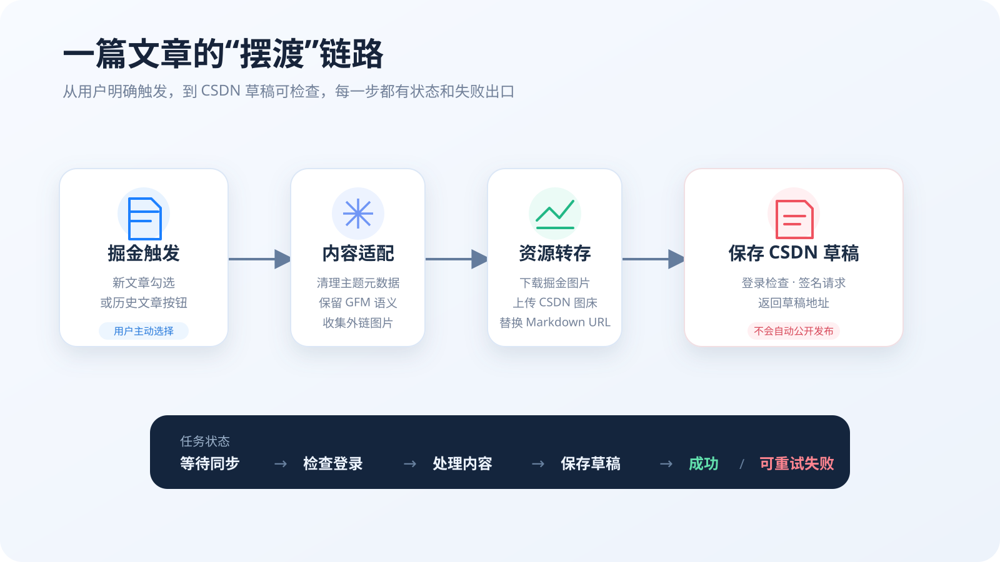

<div align="center">
  
  <h1>⛵ 文章摆渡 (Article Ferry)</h1>
  <p><b>面向技术创作者的轻量、端侧安全内容中枢 · 把掘金文章优雅可靠地摆渡到 CSDN 草稿箱</b></p>

  [](https://github.com/Xxcool/juejin-csdn-extension/releases)
  [](https://developer.chrome.com/docs/extensions/mv3/intro/)
  [](https://github.com/Xxcool/juejin-csdn-extension/actions)
  [](PRIVACY.md)
  [](LICENSE)
</div>

---

## 📖 项目简介

**「文章摆渡」** 是一款基于 Chrome Manifest V3 规范打造的去中心化、端侧安全的内容同步工具。以掘金为核心创作入口，在创作者明确勾选确认后，将新发布或历史文章可靠地同步至 CSDN 草稿箱。

> [!IMPORTANT]
> **人机协作与安全原则 (Human-in-the-loop)**：  
> 工具专注消灭 90% 的机械搬运、格式清洗与图床转存工作，**坚决不替用户公开发布**。分类、标签及最终发布确认权永远保留在目标平台草稿箱，严格敬畏平台规则与创作者资产安全。

---

## ✨ 核心特性

### 🚀 智能同步与草稿幂等
* **发文无感联动**：掘金发文面板点击“确定并发布”时后台秒级触发，不阻塞掘金正常发文与审核；
* **历史文章批量迁移**：在掘金创作者中心文章管理列表中，一键将历史博文完整摆渡至 CSDN；
* **双身份草稿幂等**：基于 `article_id` 与 `draft_id` 双重映射，二次修改发文原地覆盖草稿，杜绝重复废稿；
* **400 删稿自愈**：若旧草稿在 CSDN 被手动删除，更新时智能识别并自动降级为新建草稿，复用已转存图片不卡死。

### 🧪 体验深化与版权护航 (v0.6.0)
* **同步前排版预演 (Dry-run)**：任务卡片支持一键预演，静态分析字数、外链图片、分类命中与特有容器，**全程不写草稿、不传图片**，从源头避免产生测试废稿；
* **CSDN 专栏动态拉取**：设置页默认分类实时拉取当前登录账号的已有专栏（datalist 下拉建议），告别手动打字；
* **正文摘要自动生成**：优先读取掘金作者手填摘要，缺失时自动提取正文前 100 字纯文本写入 CSDN 编辑器；
* **掘金首发声明注入**：文章末尾自动注入 `> 本文首发于掘金：[文章标题](链接)`，保障多平台 SEO 权重与原创权益。

### 🖼️ 高清图床转存与语法清洗
* **无水印原图直链提取**：智能剔除掘金 CDN 图片的 `~tplv-` 模板与 OSS 裁剪水印参数，转存纯净原图；
* **特有容器语法转译**：识别掘金特有 `:::tips`、`:::note` 等语法，自动清洗为通用 Markdown 引用块；
* **三路并发与限流退避**：图片转存采用 3 路有限并发与指数退避重试，正文图失败自动保留外链兜底，防 429 限流。

### 🎨 旗舰工艺设计与系统通知
* **旗舰工艺版 UI 2.0**：Raycast 质感设计系统、一叶轻舟破浪专属舰徽、物理弹簧分段滑块、呼吸光晕与微胶囊筛选轨；
* **自适应深色模式**：遵循 Design Tokens，深浅色主题平滑过渡，夜间创作视觉柔和不刺眼；
* **Chrome 原生系统通知**：多图与长耗时任务在后台完成后系统主动提醒，点击直达草稿编辑页；失败任务即时播报；
* **轻量远程健康预警**：定时拉取 GitHub 兼容性状态，接口变动提前警示，失败静默容错。

---

## 🛡️ 可靠性与安全底座

<div align="center">
  
  <p><i>▲ 端到端处理管线：从用户明确触发到草稿安全落地的每一步均具备失败隔离与状态出口</i></p>
</div>

* **零 Cookie 权限**：不申请 `cookies` 权限，不存储用户账号密码，直接复用当前浏览器现有登录态；
* **端侧去中心化**：所有清洗、渲染与网络请求均在本地闭环执行，不经由任何第三方代理或服务器；
* **存储瘦身防爆仓**：持久化剥离正文大文本，采用双路径按需拉取，彻底规避 `storage.local` 10MB 配额上限；
* **结构化脱敏诊断**：细分 8 类错误与 6 大执行阶段，支持一键复制脱敏诊断日志，快速排错。

---

## 📥 安装与使用

### 方式一：从 GitHub Releases 离线安装（推荐）
1. 前往 [Releases 发行页](https://github.com/Xxcool/juejin-csdn-extension/releases) 下载最新的 `article-ferry-v*.zip` 并解压；
2. 打开 Chrome 浏览器，访问 `chrome://extensions`；
3. 开启右上角的 **“开发者模式”**；
4. 点击左上角 **“加载已解压的扩展程序”**，选择解压后的目录；
5. 在同一浏览器中登录掘金与 CSDN，点击扩展图标即可开始使用。

### 方式二：从源码构建与开发
要求 **Node.js 20+**：
```bash
git clone https://github.com/Xxcool/juejin-csdn-extension.git
cd juejin-csdn-extension
npm install
npm run check    # TypeScript 严格类型检查
npm test         # Vitest 全量单元测试 (41 tests)
npm run build    # esbuild 生产产物打包 (输出到 dist/)
```

---

## 🎯 实操指南

### 1. 撰写新文章同步
1. 在掘金写完文章并点击右上角“发布”；
2. 发布面板中默认勾选 **“同步到 CSDN 草稿”**；
3. 点击“确定并发布”，后台自动启动同步管道；
4. 扩展弹窗中可查看实时进度，点击 **“草稿 ↗”** 直达 CSDN 编辑器完成最终确认。

### 2. 同步前排版预演 (Dry-run)
1. 在扩展弹窗的任务记录卡片中，点击 **“预演”** 按钮；
2. 弹窗将立即展示字数统计、命中分类、待转存图片清单、容器转译详情与潜在风险提示；
3. 确认无误后再发起同步，从源头避免产生测试废稿。

---

## 🔒 权限与隐私声明

本项目严格遵循最小权限原则：

| 权限声明 / 域名 | 核心用途 |
| :--- | :--- |
| `storage` | 在本地浏览器保存用户的同步偏好设置与任务状态记录（不上传云端） |
| `notifications` | 长耗时/多图任务完成或失败时触发 Chrome 原生系统通知，点击直达草稿 |
| `alarms` | 每 12 小时触发一次轻量远程健康检查，预警平台接口变动 |
| `declarativeNetRequestWithHostAccess` | 仅为必要的掘金/CSDN 官方接口补充 Web 客户端必需的校验请求头 |
| `juejin.cn` / `api.juejin.cn` | 注入发文同步控件，并拉取创作者主动选择同步的文章内容 |
| 掘金图片 CDN 域 | 下载正文与封面高清图片以便转存至目标平台 |
| `bizapi.csdn.net` | 检查 CSDN 登录在线状态、拉取个人专栏分类、获取上传凭证及保存草稿 |
| CSDN 图片存储服务 | 将转存后的图片流安全写入创作者个人的 CSDN 空间 |

---

## 🤝 参与贡献与开源协议

本项目基于 [MIT License](LICENSE) 协议开源，欢迎提交 Issue 与 PR。第三方依赖声明详见 [THIRD_PARTY_NOTICES.md](THIRD_PARTY_NOTICES.md)。
