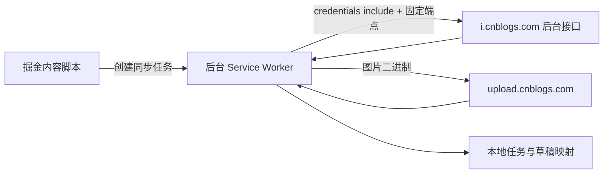

# 博客园草稿同步：技术方案与验证计划

> 状态：已按方案完成实现与自动化验证
> 目标：在不申请 Cookie 权限、不保存账号凭据的前提下，沿用浏览器登录态，将掘金文章同步到博客园草稿箱。

## 1. 背景与目标

文章摆渡目前支持把掘金文章同步至 CSDN 和微信公众号草稿箱。本需求新增博客园作为第三个目标平台，并继续遵守现有产品边界：

- 仅在用户主动勾选或发起历史文章同步时执行；
- 只创建或更新草稿，不自动公开发布；
- 沿用当前 Chrome 配置文件中的博客园登录态；
- 不要求用户提供 PAT、MetaWeblog Token、账号或密码；
- 不申请 `cookies` 权限，不读取、导出或持久化 Cookie；
- 文章内容直接从扩展发送至博客园，不经过开发者中转服务器；
- 同一来源文章、同一博客园账号只维护一个可确认的草稿映射。

首版目标能力：

| 能力 | 首版要求 |
| --- | --- |
| 掘金发布成功后同步 | 支持，博客园默认不勾选 |
| 历史文章手动同步 | 支持 |
| Markdown 正文 | 支持，清理掘金特有语法 |
| 正文图片 | 全部转存，任一失败则终止保存 |
| 标签与分类 | 仅接入已经实测确认的字段 |
| 新建草稿 | 必须支持并验证为未发布状态 |
| 更新已有草稿 | 仅在能可靠确认目标仍为草稿时支持 |
| 已发布文章保护 | 禁止自动覆盖 |
| 账号切换保护 | 任务和映射按稳定账号标识隔离 |

不在首版范围内：自动公开发布、定时发布、删除博客园文章、从博客园反向同步、批量迁移、保存账号凭据，以及未经验证的封面能力。

## 2. 已确认事实与待验证项

### 2.1 已确认事实

博客园存在未发布草稿，并在后台管理界面提供草稿列表。博客园官方后台 API 文档也定义了 `IsPublished` 字段；该字段默认值为 `true`，因此任何创建请求都必须显式指定未发布，不能依赖默认值。

官方公开创建接口使用 PAT：

```text
POST https://i.cnblogs.com/openapi/v1/posts
Authorization: Bearer <PAT>
Authorization-Type: pat
```

该接口不符合本需求的认证边界，不能作为实现路径。

博客园后台使用 CSRF 校验。当前编辑器先请求 `GET /api/xsrf`，响应返回 `headerName` 与 `requestToken`，随后把令牌放进写请求头。扩展无需读取 Cookie：

```text
GET https://i.cnblogs.com/api/xsrf
POST https://i.cnblogs.com/api/posts
<headerName>: <requestToken>
```

登录凭据由浏览器随 `credentials: include` 自动携带。实现不申请 `cookies` 权限，也不读取、导出或保存 Cookie 与 CSRF 值。

博客园图片上传服务位于独立域名 `upload.cnblogs.com`。扩展后台通过精确的 `host_permissions` 和浏览器登录态调用固定上传端点。

### 2.2 不能混用的状态

博客园公开文档中的 `reviewStatus` 是内容审核状态：

- `0`：待审核；
- `1`：审核通过；
- `2`：审核不通过。

它不表示文章是草稿还是已发布，不能用来决定是否允许更新。草稿判断必须读取后台文章详情中的 `isPublished`、`isDraft` 或经过实测确认的等价字段。

### 2.3 Phase 0 必须验证

以下内容在真实登录态下验证通过之前，不得进入完整写入实现：

1. 登录状态探测接口及未登录响应；
2. 稳定账号标识、博客开通状态、博客地址和显示名称；
3. 新建草稿的真实请求地址、方法、CSRF 要求和请求体；
4. 新建成功响应中的文章 ID、草稿状态和编辑地址；
5. 按文章 ID 读取详情的接口及草稿状态字段；
6. 更新草稿时所需的完整字段和响应格式；
7. 已发布、已删除、无权限和状态未知的响应差异；
8. 分类、标签的读取与写入格式；
9. 图片上传接口、格式限制、大小限制及返回 URL；
10. CSRF 过期、登录失效和账号切换后的表现。

Phase 0 的只读探测不修改远端数据。新建测试草稿和上传测试图片会产生博客园侧数据，执行验证前应使用明确的测试文章并取得相应授权；测试产物不自动删除。

## 3. 总体架构

### 3.1 后台固定端点适配器

使用后台 Service Worker 发起固定的博客园请求。`GET /api/user` 同时判断登录和博客开通状态，`GET /api/xsrf` 提供写请求令牌：



博客园适配器负责：

- 确认登录状态与博客开通状态；
- 从 `/api/xsrf` 获取一次性写请求头；
- 仅向固定博客园端点发起请求；
- 查询账号和目标文章状态；
- 上传正文图片；
- 创建或更新草稿；
- 把不包含 Cookie、CSRF 和敏感响应头的结构化结果返回后台。

后台 Service Worker 负责：

- 创建和持久化同步任务；
- 回填掘金正文；
- 校验消息来源与目标账号；
- 编排内容处理、图片上传和草稿保存；
- 维护中断恢复、失败诊断和草稿映射；
- 更新扩展面板与系统通知。

### 3.2 登录页生命周期

执行博客园任务时：

1. 后台直接执行登录探测，不为状态检测打开新标签页；
2. 未登录时打开 `https://i.cnblogs.com/posts/edit`，并把历史文章请求加入现有短期登录续传队列；
3. 登录完成后由用户重试或通过现有恢复入口继续。

写请求发出后若未收到可解析响应，任务进入“结果不确定”，不得无条件重试新建。

### 3.3 请求安全

博客园适配器只封装固定动作，不提供任意 URL、HTTP 方法或请求头能力：

```ts
type CnblogsBridgeAction =
  | 'GET_SESSION'
  | 'GET_POST_STATE'
  | 'GET_CATEGORIES'
  | 'UPLOAD_IMAGE'
  | 'CREATE_DRAFT'
  | 'UPDATE_DRAFT';
```

后台执行前校验：

- 文章 ID、图片类型、正文长度和标题长度满足边界；
- 账号标识必须与任务绑定值一致；
- 返回值按本地类型契约解析，不能信任页面返回的任意 HTML 或跳转地址。

适配器不得把 Cookie、CSRF、完整响应头或页面源码写入日志、任务诊断和 `chrome.storage`。

## 4. 平台模型与本地数据

### 4.1 类型扩展

```ts
export type PlatformId = 'csdn' | 'wechat' | 'cnblogs';

export type SyncTask = {
  // 现有字段
  cnblogsAccountId?: string;
  cnblogsPostId?: string;
};

export type CnblogsDraftMapping = {
  articleId: string;
  cnblogsAccountId: string;
  cnblogsPostId: string;
  draftUrl?: string;
  updatedAt: string;
};
```

博客园账号标识必须来自 Phase 0 验证过的稳定字段，不能使用易变化的昵称作为唯一身份。

### 4.2 草稿映射

映射键：

```text
cnblogsDraftMapping:{cnblogsAccountId}:{sourceArticleId}
```

同一来源文章同时保存 `article.id` 和 `sourceDraftId` 两个身份键，与现有 CSDN、微信映射行为一致。

删除同步记录默认保留映射，防止通过清空历史绕过去重保护。只有用户明确执行“删除记录并解除关联”时才清除映射；该动作仍不删除博客园侧草稿。

### 4.3 平台执行器分发

当前后台使用“微信／其他平台”的二选一分支，新增平台后会把博客园误路由到 CSDN。实施时引入小范围的平台执行器分发，统一以下行为：

```ts
type PlatformRuntime = {
  name: string;
  checkAuth(): Promise<AuthResult>;
  validate(article: Article): void;
  getTargetId(task: SyncTask): string | undefined;
  getDraftState?(targetId: string, accountId?: string): Promise<DraftState>;
  saveDraft(article: Article, context: SaveContext): Promise<AdapterResult>;
};
```

不重写已有 CSDN 和微信适配器内部实现，只把后台的平台选择、目标 ID 和保存结果归一化，避免继续增加三平台嵌套三元表达式。

## 5. 内容与图片策略

### 5.1 Markdown 处理

博客园保持 Markdown 输入，复用已经与目标平台无关的规范化能力：

- 清除掘金主题 frontmatter；
- 将 `~~~` 围栏统一为标准代码围栏；
- 将掘金 `:::` 容器转成通用 Markdown 引用块；
- 保留标题、列表、表格、引用、链接和代码块的原始语义；
- 可按用户现有设置追加首发来源声明。

不得直接复用 CSDN 保存请求、分类参数或图片上传签名。若需要共享 Markdown 纯转换逻辑，应把明确通用的函数移动到公共模块，并用现有 CSDN 回归测试保证输出不变。

### 5.2 图片处理

同步前提取正文中的远程图片和 Data URL：

1. 下载源图片；
2. 校验 MIME、文件大小和博客园支持格式；
3. 通过博客园桥接上传；
4. 用博客园返回 URL 替换 Markdown 中的原地址；
5. 全部图片成功后才保存草稿。

首版固定采用 `abort` 策略。任意正文图片下载或上传失败时，终止草稿写入并显示失败图片数量及可执行建议。不能把缺图文章标记为同步成功。

源文章封面暂不作为博客园独立封面同步。若正文中已包含同一图片，它仍按正文图片处理。后续只有确认博客园存在稳定且语义一致的封面字段后再独立设计。

### 5.3 分类与标签

只有在 Phase 0 确认以下契约后才接入：

- 分类使用 ID 还是名称；
- 未存在分类是否允许自动创建；
- 标签数量、长度和格式限制；
- 更新文章时省略字段是否会清空原值。

首版不自动创建博客园分类。无法匹配分类时保存为未分类草稿并给出警告；标签按平台上限截取前必须提示，不能静默丢弃。

## 6. 草稿创建与更新规则

### 6.1 新建草稿

保存请求必须显式表达未发布状态。以 Phase 0 确认的实际字段为准，预期至少满足：

```text
isPublished = false
isDraft = true
```

成功判定同时要求：

- HTTP 或业务状态明确成功；
- 返回有效 `postId`；
- 可以构造或取得草稿编辑地址；
- 随后的只读查询确认文章属于当前账号且仍未发布。

若远端可能已创建成功但响应丢失、桥接页被关闭或本地映射写入失败，任务进入 `needs-user / interrupted`。用户需先检查博客园草稿箱，再明确确认重试，批量重试跳过此类任务。

### 6.2 更新草稿

再次同步前查询目标状态：

| 状态 | 处理 |
| --- | --- |
| `draft` | 允许更新；启用“更新草稿前确认”时先进入待确认 |
| `published` | 阻止覆盖并提示该文章已发布 |
| `missing` | 清除旧目标 ID；仅在明确不存在时允许新建草稿 |
| `unauthorized` | 停止并提示重新登录或核对账号 |
| `unknown` | 暂停任务，不更新也不新建 |

更新请求必须发送完整文章字段。若博客园接口采用“缺少字段即清空”的语义，先读取原文章并合并未由本次同步管理的字段，避免丢失分类、标签或其他设置。

### 6.3 状态查询不可用时的降级

如果 Phase 0 无法得到可靠的草稿状态：

- 允许首次新建草稿；
- 保存成功后记录账号和 `postId`；
- 同一来源文章再次同步时进入 `needs-user`；
- 不自动更新，也不自动新建第二份草稿；
- 用户可以打开已有草稿人工修改。

此降级能力应明确标记为“仅支持首次创建”，不能宣称已支持博客园草稿更新。

## 7. 登录、账号与恢复

### 7.1 登录检测

博客园当前账号中心使用以下请求获取登录用户：

```text
GET https://account.cnblogs.com/api/user/info
credentials: include
```

判定规则：

- 返回 `200` 且响应为有效用户对象：已经登录；
- 返回 `204`：未登录；
- 返回 `401`：未登录或登录态已经失效；
- 网络错误、超时、`5xx` 或响应结构异常：登录检测失败，不能降级显示为“未登录”。

用户对象中的 `userId`、`spaceUserId`、`blogApp` 等字段需要在 Phase 0 中确认具体语义。其中 `blogApp` 用于区分博客能力是否已经开通，不能参与登录状态判断：

| 登录 | `blogApp` | 状态 | 处理 |
| --- | --- | --- | --- |
| 否 | 无 | `logged-out` | 提示前往博客园登录 |
| 是 | 空 | `blog-unavailable` | 显示已登录，但尚未开通博客，禁止创建同步任务 |
| 是 | 非空 | `ready` | 继续检测博客后台和草稿能力 |
| 未知 | 未知 | `error` | 显示检测失败，允许用户重试 |

扩展内部登录探测返回：

```ts
type CnblogsAuthResult = {
  ok: boolean;
  loggedIn: boolean;
  blogEnabled: boolean;
  accountId?: string;
  accountName?: string;
  blogApp?: string;
  blogUrl?: string;
  message?: string;
};
```

`accountId` 优先使用经过实测稳定的不可变 ID，不能直接使用昵称。`blogUrl` 只能根据已经确认的 `blogApp` 构造，不能从显示名称猜测。

检测失败、未登录和未开通博客必须分别展示。未开通博客不触发登录流程；扩展只提供“前往申请博客”的入口，不代替用户提交申请。

### 7.2 账号隔离

创建任务时绑定当前 `cnblogsAccountId`。每次执行、恢复和更新前重新探测账号：

- 相同账号：继续；
- 不同账号：进入 `needs-user`，禁止写入；
- 无法确认账号：进入 `needs-user`，禁止写入；
- 旧任务没有账号标识：不得自动迁移或覆盖，提示从掘金重新发起。

### 7.3 Service Worker 中断

任务中断判定需要加入 `cnblogsPostId`：

- 写入前或已知目标 ID 的更新中断，可以在重新核验状态后恢复；
- 新建写入中断且没有 `postId`，结果不确定，禁止自动重试；
- 已返回 `postId` 但本地落盘失败，保留目标 ID 并进入人工处理，防止重复创建。

## 8. 界面与设置

### 8.1 掘金页面

在以下入口增加博客园平台卡片：

- 掘金发布确认弹窗；
- 创作者中心历史文章同步弹窗；
- 个人主页历史文章同步弹窗。

平台卡片展示博客园 Logo、登录状态和简短说明。未登录时提供前往博客园后台登录的动作。登录状态刷新不得重新勾选用户已取消的平台。

### 8.2 扩展面板

增加：

- 博客园登录状态；
- 博客园任务徽标和平台筛选信息；
- 草稿编辑入口；
- 账号不一致、已发布阻断和结果不确定的针对性诊断；
- “默认选择博客园”设置，默认值为 `false`。

同步预演若首版复用现有能力，应明确展示博客园的图片数量、容器转换、代码块数量和已知不兼容项；不得把 CSDN 分类预演误用于博客园。

## 9. Manifest、构建与文档改动

预计新增权限范围：

```json
{
  "host_permissions": [
    "https://i.cnblogs.com/*",
    "https://upload.cnblogs.com/*"
  ]
}
```

实际域名以 Phase 0 抓取结果为准，权限保持最小范围。图片最终 CDN 只有在扩展需要主动读取时才加入权限。

实现完成后同步更新：

- `manifest.json` 中的名称、描述、权限和内容脚本；
- `README.md` 的平台矩阵、安装、使用、设置和 FAQ；
- `PRIVACY.md` 的目标平台和数据流说明；
- `SECURITY.md` 的平台接口变化与凭据边界；
- `health.json` 及健康状态模型中的博客园字段；
- `CHANGELOG.md` 和发布说明。

## 10. 分阶段实施计划

### Phase 0：契约验证

- 完成真实登录态只读探针；
- 记录请求端点、字段、状态码及脱敏响应样例；
- 验证 CSRF 获取与失效恢复；
- 验证账号稳定标识和账号切换；
- 经授权创建一篇最小测试草稿并读取确认；
- 经授权上传一张测试图片并确认 URL；
- 得出是否支持安全更新草稿的结论。

退出条件：新建草稿可重复验证；不会公开发布；账号可识别；写入结果可确认。若退出条件不满足，暂停自动写入开发。

### Phase 1：平台模型与适配器

- 扩展 `PlatformId`、任务字段和草稿映射；
- 建立博客园固定端点适配器；
- 增加登录检测、博客开通状态与账号校验；
- 将后台平台选择改为明确执行器分发；
- 补充任务中断和去重逻辑。

### Phase 2：内容与新建草稿

- 增加博客园 Markdown 处理；
- 增加正文图片下载、上传和替换；
- 实现新建草稿及保存后状态确认；
- 接入进度、统计、诊断和通知；
- 实现结果不确定保护。

### Phase 3：更新与界面

- 在状态接口验证通过时实现草稿更新；
- 接入三个掘金同步入口；
- 更新扩展面板和设置；
- 增加博客园 Logo、文案和健康状态；
- 完成隐私、安全和用户文档。

### Phase 4：回归与发布准备

- 运行类型检查、自动化测试和生产构建；
- 在测试账号验证新建、更新、已发布阻断和图片转存；
- 检查升级后旧任务、旧设置和旧映射兼容；
- 检查三个平台并行同步互不影响；
- 准备版本说明及已知限制。

## 11. 测试与验收

### 11.1 单元与契约测试

- 平台执行器把博客园准确路由到博客园适配器；
- 博客园任务不会写入 `csdnArticleId` 或 `wechatAppMsgId`；
- 映射按来源文章和博客园账号隔离；
- 旧设置缺少博客园字段时默认关闭；
- 旧任务读取不受影响；
- CSRF、Cookie 和完整接口响应不进入 storage 或诊断；
- 草稿、已发布、不存在、未授权和未知状态分类正确；
- 新建中断不会参加批量自动重试；
- 更新请求保留必须字段；
- 图片失败阻止草稿写入；
- 消息处理拒绝任意 URL 和未知动作。

### 11.2 集成场景

1. 已登录账号新建无图草稿；
2. 已登录账号新建多图草稿；
3. 未登录时打开登录页并保留请求意图；
4. 登录过期后得到明确诊断；
5. 同一文章再次同步并更新现有草稿；
6. 目标文章已公开时阻止覆盖；
7. 目标草稿被删除时按明确缺失策略处理；
8. 状态接口异常时不更新、不新建；
9. 切换博客园账号时阻止写入；
10. 上传部分图片失败时不保存残缺草稿；
11. 写入返回后本地落盘失败时不重复创建；
12. 用户关闭桥接标签页时任务正确进入失败或结果不确定；
13. CSDN、微信、博客园同时同步时分别记录结果；
14. 清空同步历史后草稿映射仍能防止重复创建。

### 11.3 项目验证命令

按项目现有工具链执行：

```bash
npm run check
npm test
npm run build
```

不虚构额外检查命令。涉及登录、图片和草稿状态的真实平台行为必须保留人工验收记录，单元测试不能替代真实接口验证。

## 12. 风险与决策门槛

| 风险 | 处理 |
| --- | --- |
| 博客园后台接口未公开且可能变化 | 独立适配器、契约测试、健康状态和明确诊断 |
| CSRF 无法稳定取得 | 暂停写入实现，不申请 Cookie 权限绕过既定边界 |
| 无法读取可靠草稿状态 | 首版仅首次新建，再次同步进入人工处理 |
| 图片接口限制扩展来源 | 通过博客园第一方页面桥接；验证失败则暂停完整同步 |
| 账号标识不稳定 | 不保存草稿映射，不启用自动写入 |
| 写入超时导致结果未知 | 标为 `interrupted`，禁止自动新建重试 |
| 三平台条件分支误路由 | 引入明确的平台执行器分发并覆盖测试 |
| 用户手工修改草稿被覆盖 | 更新前确认设置生效，状态不明确时阻断 |

最终开工门槛：Phase 0 必须证明浏览器登录态下能够稳定识别账号、创建未发布草稿并读取其草稿状态。缺少任一项时，只实现已经验证安全的能力，并在产品界面明确限制。

## 13. 参考资料

- [博客园后台 API 说明文档](https://www.cnblogs.com/cmt/articles/19246558)
- [Chrome Extensions：Cross-origin network requests](https://developer.chrome.com/docs/extensions/develop/concepts/network-requests)
- [Chrome Extensions：Cookies API](https://developer.chrome.com/docs/extensions/reference/api/cookies)
