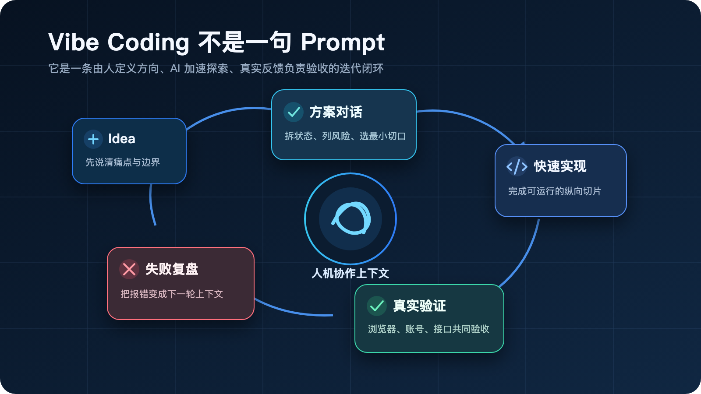
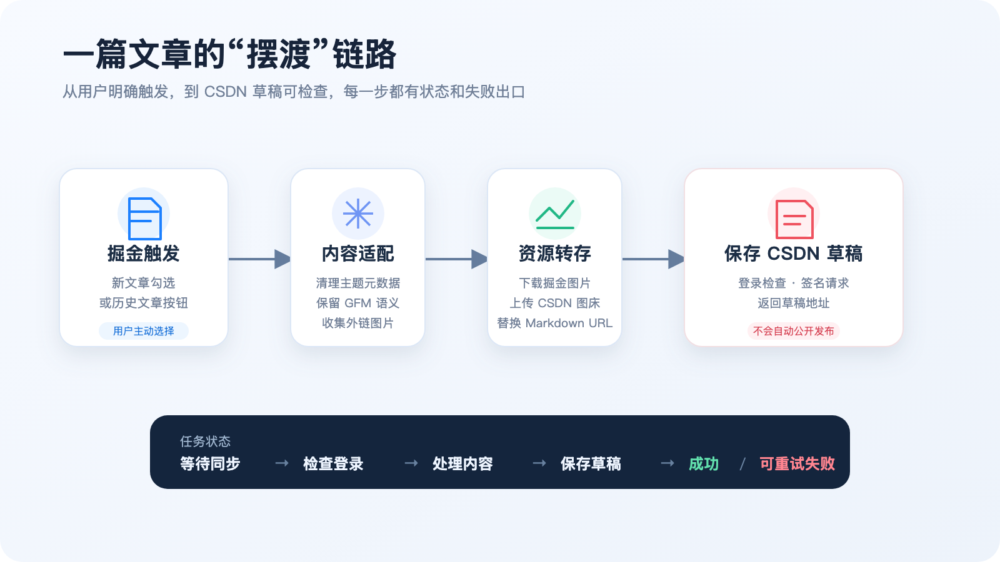

# 从一句 Idea 到开源插件：我用 Vibe Coding 做了「文章摆渡」


事情开始于一个很小、甚至有点“不值得专门开发”的痛点。

我习惯在掘金写技术文章，但写完后还会同步到 CSDN。每次都要复制标题、正文、代码块和图片，再重新检查格式。短文章还能忍，长文章一旦包含十几张图片和多段代码，复制粘贴就变成了一次重复且容易出错的人工发布流程。

我脑子里冒出一个 Idea：

> 能不能做一个 Chrome 插件，在掘金发布文章时勾选一下，就把内容送到 CSDN 草稿箱；历史文章也能在“更多”菜单里一键同步？

这就是「文章摆渡」的起点。

更特别的是，这个项目大部分过程都是我和 AI coding agent 一起完成的：从需求澄清、仓库分析、方案设计，到编码、浏览器验证、Bug 修复，再到开源仓库、CI 和 Release。

但它并不是“一句话让 AI 生成整个插件”的故事。

恰恰相反，这次实践让我更确定：**Vibe Coding 真正有效的地方，不是省掉思考，而是让想法、实现和反馈之间的距离变短。**

## 先说结论：Vibe Coding 不是闭眼接受 AI 的代码

很多人理解的 Vibe Coding，大概是：描述需求，AI 写代码，能跑就结束。

我的实际过程更接近一个不断收紧范围的协作闭环：



在这个循环里，人和 AI 的职责并不相同。

| 角色 | 主要负责什么 |
| --- | --- |
| 我 | 定义痛点、决定产品边界、判断风险、提供真实页面和账号环境、验收最终体验 |
| AI | 快速阅读代码、梳理状态流、提出候选方案、实现代码、执行检查、定位错误和维护文档 |
| 共同完成 | 根据真实反馈修正方案，把一次性脚本逐渐变成可维护的产品 |

AI 可以非常快地生成“看起来合理”的实现，但页面结构、登录语义、跨域规则和发布边界不能只靠猜。

所以这次 Vibe Coding 有一个始终没变的原则：

> AI 负责加速探索，真实环境负责给出答案，人负责最终决策。

## 第一步不是写代码，而是把 Idea 砍成一个可验证的 MVP

如果一开始就说“做一个多平台文章分发工具”，范围会立刻失控：平台管理、账号体系、标签映射、定时发布、数据统计、重复更新……每一项都可以继续展开。

我和 AI 的第一轮讨论，没有直接生成代码，而是先把第一阶段收敛成两个场景。

### 场景一：新文章发布时主动勾选同步

在掘金新文章的发布区域增加一个同步选项。

只有同时满足两个条件才同步：

1. 用户主动勾选“同步到 CSDN”；
2. 掘金已经确认发布成功。

第二点非常重要。如果用户刚点击“发布”，插件就立即向 CSDN 写入，那么掘金校验失败、网络异常或者用户取消时，CSDN 仍可能留下不该出现的内容。

因此实现上采用“先暂存、后确认”：

```text
点击最终发布
  → 暂存文章快照
  → 等待掘金发布结果
  → 出现文章 ID / 发布成功状态
  → 创建 CSDN 同步任务
```

### 场景二：历史文章在“更多”菜单中一键同步

对于已经发布的文章，插件在本人文章列表的“更多”菜单中增加“同步到 CSDN”。

它不会从文章详情页抓取渲染后的 HTML，而是根据文章 ID 找到对应的创作者草稿，读取原始 Markdown。

历史按钮也不能出现在任何人的文章下面，所以插件只向同时具有“编辑”和“删除”操作的本人文章菜单注入入口。

### 一个关键产品决定：CSDN 只保存草稿

技术上，继续自动点击发布并不困难，但我没有这么做。

不同平台的分类、标签、封面和读者语境都可能不同。插件适合替我完成机械搬运，却不应该替我做最终发布决定。

于是第一阶段的边界很明确：

> 掘金可以正常发布；CSDN 永远只生成草稿，最后由作者检查并决定是否公开。

这个边界也成为后续所有技术方案的判断标准。

## 从方案到链路：先画清楚文章到底怎么走

需求收敛后，AI 帮我把页面交互、后台状态和平台适配拆成一条完整链路：



插件被拆成四层：

```text
掘金页面集成
    ↓ 读取标题、Markdown、文章 ID
后台任务协调器
    ↓ 登录检查、状态流转、失败重试
内容适配层
    ↓ 清理元数据、解析 GFM、转存图片
CSDN Web 适配器
    ↓ 保存草稿、返回草稿地址
```

这个阶段 AI 最大的价值，不是帮我“想出一个高深架构”，而是把模糊需求转换成可以逐项验收的问题：

- 编辑器内容从哪里读取？
- 怎样确认掘金真的发布成功？
- 未登录 CSDN 时如何续接任务？
- 图片为什么不能直接沿用原地址？
- 失败之后用户在哪里看、怎么重试？
- 哪些权限是必须的，哪些权限可以删掉？

这些问题一旦写清楚，编码就不再是漫无目的地试。

## 落地实践一：content script 看得到页面，却拿不到编辑器

掘金编辑器基于 CodeMirror。文章内容存在页面 JavaScript 的运行环境中，而 Chrome content script 默认运行在隔离世界里。

两边共享 DOM，但不共享 JavaScript 变量。插件能看到编辑器节点，却不能直接访问页面内部的编辑器状态。

AI 最初给出了几种候选方案：模拟快捷键复制、读取隐藏 textarea、从页面接口重新请求、注入 MAIN world 脚本。结合稳定性和数据边界，最后选择了一个很窄的桥接方案：

1. 一个运行在 `MAIN world` 的脚本读取标题和 CodeMirror Markdown；
2. 将文章快照临时写入 DOM 属性；
3. 通过自定义事件通知隔离环境的 content script；
4. content script 读取后立即删除临时属性；
5. 再通过 `chrome.runtime.sendMessage` 交给后台。

```text
页面运行环境（MAIN world）
        ↓ 自定义事件 + 临时快照
扩展隔离环境（content script）
        ↓ runtime message
后台 Service Worker
```

这里的重点不是“绕过 Chrome 隔离”，而是只开放任务所需的最小数据通道。

## 落地实践二：同步不是一次点击，而是一个可恢复的任务

如果把同步写成一个从头跑到尾的函数，用户看到的结果通常只有两种：成功，或者没反应。

在 AI 帮助梳理状态之后，我把任务明确拆成：

```text
queued
  → checking-login
  → transforming
  → writing
  → saved

任意阶段
  → needs-user / failed
  → retry
```

新文章使用 `STAGE_ARTICLE` 暂存，在确认发布后通过 `CONFIRM_PUBLISH` 创建任务；历史文章如果没有登录 CSDN，则把待处理信息暂存到 `chrome.storage.session`，登录完成后继续执行。

同步历史保存在 `chrome.storage.local`，弹窗会展示文章标题、执行时间、目标平台、失败原因和草稿入口。

这一层让同步不再是一段“祈祷它别报错”的自动化，而是一个用户能看懂、能重试、能清理的流程。

## 落地实践三：两个平台都支持 Markdown，不代表可以原样复制

第一个可运行版本很快出现了几个问题：

- 正文顶部带着 CSDN 不需要的 `theme` 配置；
- 代码围栏被简单正则破坏；
- 图片地址还在，但 CSDN 中无法显示；
- 文章末尾出现了一句并不需要的同步来源说明。

这些问题非常适合 Vibe Coding 的节奏：把真实失败现象直接交给 AI，让它回到具体数据格式和处理顺序，而不是继续猜 UI。

### 清理掘金主题元数据

部分 Markdown 顶部可能包含：

```yaml
---
theme: juejin
highlight: a11y-dark
---
```

CSDN 没有对应主题概念。同步前需要识别包含 `theme` 或 `highlight` 的 front matter，并移除整个元数据块。

### 用标准 GFM 处理代码块

早期版本使用几条正则把 Markdown 转成 HTML，而且先处理行内代码、再处理三反引号围栏。结果是代码块内部已经被改写，后续规则自然无法正确识别。

现在插件使用标准 GFM 解析流程，同时保留原始 Markdown 和生成后的 HTML：

```javascript
const message = '文章已保存到 CSDN 草稿箱'
console.log(message)
```

这让代码语言、转义字符、列表、引用和链接结构都能保留下来。

### 图片不能只搬 URL，要把文件也搬过去

掘金图片通常位于自己的 CDN。原地址复制到另一个平台后，可能受到防盗链、跨域策略或者地址生命周期影响。

最后确定的图片流程是：

1. 收集正文和封面中的外链图片；
2. 在浏览器中下载原图；
3. 获取 CSDN 图片上传凭证；
4. 将图片直接上传到 CSDN 图片存储；
5. 用新地址替换 Markdown 中的原地址；
6. 所有图片处理成功后，再保存草稿。

如果其中一张图片失败，任务会明确失败并显示原因，而不是悄悄保存一篇图片全部失效的草稿。

这是我很喜欢的一处设计：**与其制造一个看似成功的结果，不如让失败足够可见。**

## Vibe Coding 最有价值的一次：不是生成代码，而是修正一次越界

开发中出现过一个很不体面的 Bug。

为了让扩展后台调用 CSDN 编辑器接口，需要通过 `declarativeNetRequest` 为指定请求设置正确的 `Origin` 和 `Referer`。

快速迭代时，规则一度匹配了整个 `bizapi.csdn.net`。结果插件不仅修改了自己的请求，还可能误伤 CSDN 个人中心发出的接口，最终触发 CORS 错误。

浏览器给出的错误很明确：接口期望的是个人中心来源，但响应头被插件改成了编辑器来源。

这次修复没有继续“多加几个兼容条件”，而是回到权限模型本身：

- 博客编辑和图片上传分别使用精确路径；
- 排除由 CSDN 页面自身发起的请求；
- 限定资源类型为 `xmlhttprequest`；
- 删除不再需要的宽泛站点权限；
- 移除没有实际用途的 `tabs` 权限。

```text
错误范围：bizapi.csdn.net/*

正确方向：
  blog-console-api/需要的范围
  resource-api/图片上传接口
  + 排除 csdn.net 页面发起方
```

这件事让我意识到，AI 很擅长根据目标生成“能够工作”的配置，却不会天然替你承担配置的影响半径。

Vibe Coding 不是相信每一次生成，而是把错误快速变成下一轮上下文：

```text
现象 → 真实请求 → 根因 → 收窄规则 → 回归验证
```

AI 在这里最有价值的角色，是帮助我快速完成证据之间的推理和修改；最终判断仍来自真实浏览器行为。

## 从“能在我电脑上跑”到“别人敢安装”

插件功能完成后，我又让 AI 以开源审查的视角重新检查项目。这一步和写业务代码完全不同，关注的是别人能否理解、构建和信任它。

最终补齐了这些内容：

- `.gitignore`，排除 `.DS_Store`、依赖、构建目录和本地环境文件；
- `PRIVACY.md`，说明文章、图片和本地任务数据如何流转；
- `SECURITY.md`，明确 Cookie、账号凭据和漏洞报告边界；
- `THIRD_PARTY_NOTICES.md`，列出第三方开源依赖；
- GitHub Actions，自动执行 TypeScript 检查和 Release 构建；
- 可复现的 ZIP 打包脚本；
- 使用 GitHub noreply 邮箱提交，避免公开本机公司邮箱；
- 对源码、Release ZIP 和生产依赖进行安全扫描。

项目最终以 MIT License 公开：

> GitHub：[Xxcool/juejin-csdn-extension](https://github.com/Xxcool/juejin-csdn-extension)

首个公开版本是 `v0.1.0`，目前暂未提交 Chrome Web Store。

## 如何直接使用

### 从 GitHub Release 安装

1. 打开项目的 [Releases](https://github.com/Xxcool/juejin-csdn-extension/releases)；
2. 下载最新的 `article-ferry-v*.zip`；
3. 解压 ZIP；
4. 在 Chrome 打开 `chrome://extensions`；
5. 开启“开发者模式”；
6. 点击“加载已解压的扩展程序”，选择解压后的目录；
7. 在同一个 Chrome 中登录掘金和 CSDN。

### 同步新文章

1. 在掘金新建并完成文章；
2. 打开发布面板；
3. 勾选 CSDN 同步选项；
4. 正常发布掘金文章；
5. 掘金确认发布成功后，插件自动生成 CSDN 草稿；
6. 从插件同步历史打开草稿，完成最终检查。

### 同步历史文章

1. 进入自己的掘金文章列表；
2. 打开目标文章的“更多”菜单；
3. 点击“同步到 CSDN”；
4. 如果尚未登录 CSDN，先完成登录；
5. 同步结束后，从插件历史记录打开 CSDN 草稿。

GitHub 安装版目前不会自动更新，升级时需要重新下载并加载新版本。

## 这次 AI 真正帮我完成了什么

如果只看最终代码，很容易把这个项目总结成“AI 帮我写了一个浏览器插件”。这个说法既没错，也不够准确。

AI 确实显著加快了很多事情：

- 在陌生代码和页面结构中快速建立上下文；
- 将口语需求拆成状态和边界；
- 同时修改 TypeScript、Manifest、DNR、CSS 和构建脚本；
- 根据控制台错误定位 Markdown、图片和跨域问题；
- 自动执行类型检查、构建、JSON 校验和安装包检查；
- 生成隐私文档、开源说明、CI 和 Release 流程；
- 在每次失败后保留上下文，继续完成下一轮修正。

但下面这些决定依然必须由我做：

- 第一阶段到底做哪些功能；
- 是否允许自动公开发布；
- 什么样的登录和发布行为才符合预期；
- 哪些权限可以接受；
- 真实页面上按钮是否自然；
- 一个错误是应该兼容，还是应该暴露并让用户重试；
- 项目何时达到了可以公开的程度。

所以我更愿意把这次过程称为“AI 放大后的产品开发”，而不是“AI 替我写代码”。

## 我对 Vibe Coding 的三个新认识

### 1. 先给边界，再给需求

“帮我做一个文章同步插件”太宽泛。

“只处理本人文章、必须主动触发、掘金发布成功后才同步、CSDN 永远保存草稿”才是可以实现和验收的需求。

### 2. 把报错当作上下文，不要当作失败终点

图片裂开、代码块错误、CORS 越界都不是靠第一版方案预判出来的。

真正高效的方式是尽快得到一个可运行纵向切片，让真实错误出现，再把错误、网络请求和页面状态交给 AI 继续推理。

### 3. AI 生成越快，验证越要具体

代码生成速度提高后，瓶颈会转移到判断：

- 功能有没有误触发？
- 权限是不是过大？
- 页面更新后会不会静默失效？
- “保存成功”到底由什么证据确认？

Vibe Coding 不是减少验证，而是要求更快、更频繁、更贴近真实环境地验证。

## 写在最后：从复制粘贴，到一条可控的摆渡航线

回头看，这个插件最简单的部分，反而是把一段 Markdown 从 A 传到 B。

真正构成产品的，是那些看不见的细节：发布确认、页面隔离、登录续接、图片归属、Markdown 语义、任务状态、失败恢复、权限范围和隐私边界。

而 Vibe Coding 给我的最大帮助，不是让我跳过这些问题，而是让我有能力更快地逐个面对它们。

一句 Idea 可以很快变成第一版代码，但从第一版代码到一个别人愿意安装的开源项目，中间仍然需要真实反馈、反复取舍和持续验证。

「文章摆渡」目前依然很克制：只支持掘金到 CSDN，只保存草稿，也依赖两个平台当前的页面和接口。后续我还会继续完善标签映射、重复同步策略、图片进度、自动化浏览器测试和更友好的安装方式。

但这个小项目已经验证了一件事：

> 好的 Vibe Coding，不是让 AI 替你把代码写完；而是让人负责方向，让 AI 加速航行，让真实世界决定航线是否可靠。

如果你也在用 AI 做自己的小工具，欢迎分享你的 Idea、工作流，以及那些只有跑进真实环境后才会出现的坑。
