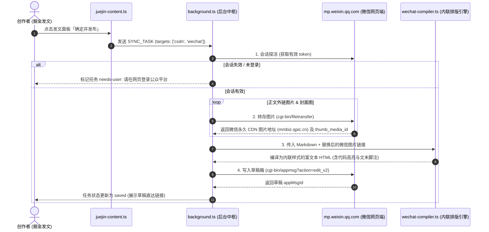

# 微信公众号草稿箱同步 · 架构与落地执行方案 (WeChat Official Account Sync Plan)

> **文档定位**：「文章摆渡」多平台生态扩张专向技术方案（单一事实来源 SSOT）。  
> **目标版本**：v1.1.0 跨平台生态矩阵  
> **核心承诺**：**0 元费用**、**零云端服务器**、**纯端侧本地会话复用**、**只进草稿箱绝不越权群发**。

---

## 一、 方案背景与核心原则

### 1. 为什么支持微信公众号？
掘金博主在多平台分发时，最大的时间黑洞往往不是 CSDN，而是**微信公众号**：
- **排版门槛极高**：微信公众平台后台不支持 Markdown，普通复制粘贴会导致代码块崩溃、行间距失控、标题样式缺失；创作者被迫使用外部第三方排版编辑器二次倒腾。
- **外链图片强拦截**：微信实施最严苛的防盗链机制，非 `mmbiz.qpic.cn` 域名的外链图片在手机端打开一律裂开或阻断。
- **外链限制**：个人/未认证订阅号文章无法在正文插入外部链接，手动给文章尾部添加「参考链接标注」耗时费力。

### 2. 四大工程设计红线
1. **0 费用与零服务器（Serverless & Free）**：
   不依赖需要付费认证的微信企业 API，不架设任何中间代理服务器，不向用户收取任何软件服务费。
2. **纯端侧浏览器会话复用（Local Session Reuse）**：
   用户只需在同一浏览器中登录过 `mp.weixin.qq.com`，插件自动通过请求头注入与内部 Token 复用已有会话，无需用户录入账号、密码或 AppSecret。
3. **只进草稿箱，恪守人机边界（Draftbox Only）**：
   严格限制操作仅限于生成「公众号草稿箱（Draft Box）」，**物理阻断任何形式的自动群发**，最终审核与手机扫码群发决策权 100% 保留在创作者手中。
4. **排版保真度与代码围栏保护**：
   内置轻量级现代化技术博文排版样式（Inline CSS），支持代码高亮与外链自动转文末脚注。

---

## 二、 端到端系统架构与数据流



---

## 三、 关键技术攻坚模块

### 模块 1：微信公众平台会话探活与 Token 捕获
- **运行机制**：
  微信公众平台的网页后台请求以 URL 中的 `token` 参数（类似 `?token=12345678`）和浏览器 Cookie 双重校验。
- **获取方案**：
  1. 通过 Declarative Net Request (DNR) 或 `chrome.tabs.query` 读取当前打开或最后访问过的 `https://mp.weixin.qq.com/cgi-bin/home?t=home/index` 页面；
  2. 当用户未打开后台标签页时，由后台 Service Worker 向 `https://mp.weixin.qq.com/` 发起轻量无感 `GET`，若已登录则通过 `response.url` 重定向提取 `token`；
  3. 针对 `mp.weixin.qq.com` 配置 DNR 请求头修饰规则，自动补全 `Referer: https://mp.weixin.qq.com/` 与 `Origin: https://mp.weixin.qq.com`，消除跨域与反爬校验拦截。

### 模块 2：外链图片全量转存管线（微信图床）
微信公众平台对外部图片域名严格阻断，所有图片必须换为微信 CDN 链接：
- **正文图片转存**：
  - 接口：`POST https://mp.weixin.qq.com/cgi-bin/filetransfer?action=upload_material&f=json&ticket_id=&ticket=&token={token}&lang=zh_CN`
  - 格式：`multipart/form-data`（字段名为 `file`）
  - 返回结果：`cdn_url`（如 `https://mmbiz.qpic.cn/sz_mmbiz_png/.../640?wx_fmt=png`）
- **封面图专用转存（生成 thumb_media_id）**：
  - 微信新建草稿**必须**绑定一个合法的封面 `thumb_media_id`；
  - 接口相同，但上传参数标记为封面图素材，返回结构包含 `content` 字段（即 `thumb_media_id`）；
  - **兜底策略**：若掘金文章本身未配置封面图，自动提取正文中的第一张图片作为封面；若正文全无图片，使用插件内置的「一叶轻舟·默认品牌技术封面」上传填充。

### 模块 3：Markdown → 微信内联富文本排版引擎（AST Compiler）
由于微信富文本编辑器会在保存时**彻底过滤外部 `<style>` 样式表和 Class 属性**，必须将 CSS 直接内联到每个 HTML 标签的 `style` 属性中：

1. **内联样式映射规则**：
   - `<h1> ~ <h6>`：注入阶梯字号、字重、优雅下边距与品牌蓝色前导修饰条（如 `border-left: 4px solid #2563eb; padding-left: 8px;`）；
   - `<p>`：注入 `font-size: 15px; line-height: 1.75; color: #333333; margin: 16px 0; letter-spacing: 0.03em;`；
   - `<blockquote>`：转为优雅圆角灰色底色引用框（`background: #f8fafc; border-left: 3px solid #2563eb; padding: 12px 16px; margin: 16px 0;`）；
   - `<code>`（行内）：转为微型高光胶囊（`background: #f1f5f9; color: #ef4444; padding: 2px 5px; border-radius: 4px; font-family: Menlo, monospace; font-size: 13px;`）。
2. **代码块原生仿真方案**：
   - 微信中 `pre > code` 换行极易错乱。
   - 采用 `<section>` 容器嵌套，顶部模拟 macOS 经典三色按钮红黄绿圆点，内部代码行转为带有深色底色的 `white-space: pre-wrap; font-family: Consolas, Monaco, monospace;`，保持手机端横向可滑动体验。
3. **外链智能降级为「文末脚注」**：
   - 微信正文非公众号内链无法点击，直接暴露裸 URL 严重影响阅读体验。
   - 编译引擎遍历所有 `[链接文字](https://...)`：
     - 正文替换为：`链接文字 [1]`；
     - 文章文末自动生成规范板块：
       ```html
       <section style="margin-top: 32px; padding-top: 16px; border-top: 1px dashed #e2e8f0;">
         <h4 style="font-size: 13px; color: #64748b;">🔗 参考链接：</h4>
         <p style="font-size: 12px; color: #94a3b8;">[1] 链接文字: https://example.com</p>
       </section>
       ```

### 模块 4：微信公众平台草稿箱 API 契约
- **接口地址**：  
  `POST https://mp.weixin.qq.com/cgi-bin/appmsg?t=media/appmsg_edit_v2&action=edit&isNew=1&token={token}&lang=zh_CN`
- **请求体（Form-URL-Encoded）核心字段**：
  | 字段名 | 类型 | 说明 |
  | :--- | :--- | :--- |
  | `title` | string | 文章标题（截取最长 64 字符） |
  | `author` | string | 作者署名（来自设置或掘金用户名） |
  | `digest` | string | 摘要（自动提取纯文本前 120 字符） |
  | `content` | string | 经编译引擎排版完成后的内联 HTML 正文 |
  | `thumb_media_id` | string | 经图片转存接口获取到的封面素材 ID |
  | `show_cover_pic` | number | 正文开头是否展示封面图（`0` 否 / `1` 是，默认 0） |
  | `need_open_comment` | number | 是否开启留言（`1` 开启 / `0` 关闭） |
  | `only_open_comment` | number | 是否仅粉丝可留言（`0` 全部人） |
  | `appmsg_type` | number | 文章类型（`1` 纯图文） |
- **响应处理**：
  - `ret: 0`：成功，返回 `appMsgId`，拼接直达链接：`https://mp.weixin.qq.com/cgi-bin/appmsg?t=media/appmsg_edit&action=edit&type=10&appmsgid={appMsgId}&token={token}`
  - `ret: 200003`：登录态过期，触发重定向登录提示。
  - `ret: 200002`：参数异常，归因为内容校验错误。

---

## 四、 扩展层改动与权限清单

### 1. `manifest.json` 更新
仅需新增微信公众平台的域名访问权限，**依然严格恪守零 `cookies` 权限**：
```json
{
  "host_permissions": [
    "https://juejin.cn/*",
    "https://*.juejin.cn/*",
    "https://*.byteimg.com/*",
    "https://*.bytecdn.cn/*",
    "https://bizapi.csdn.net/*",
    "https://*.myhuaweicloud.com/*",
    "https://mp.weixin.qq.com/*"
  ]
}
```

### 2. `rules.json` (DNR) 规则扩充
新增一条针对 `mp.weixin.qq.com` 接口的 Referer 与 Origin 补全规则，保障后台 fetch 请求顺利穿透微信同源检查。

---

## 五、 UI / UX 协同体验

1. **顶栏多平台状态胶囊（Multi-Platform Capsule）**：
   - 现有的单个 CSDN 胶囊升级为多平台在线微胶囊组（`CSDN 🟢` · `微信 🟢`）；
   - 点击任一胶囊可单独刷新对应平台会话或跳转其登录页。
2. **偏好设置独立开关**：
   - 新增配置项：
     - `微信公众号同步开关`（默认开启）
     - `微信默认作者名`（支持自定义填入公众号创作者昵称）
     - `文末外链自动转脚注`（开关，默认开启）
     - `代码块风格主题`（经典深灰 / 极简浅色）
3. **任务卡片双目标徽章与双草稿直达**：
   - 任务卡片操作区展示两颗独立草稿直达胶囊：
     - `CSDN 草稿 ↗`
     - `微信草稿 ↗`
   - 预演弹窗（Dry-run）增加「微信排版差异预览」与「封面 media_id 状态」。

---

## 六、 实施排期与分阶段里程碑（4 个迭代阶段）

| 阶段 | 周期 | 交付物 | 验收标准 |
| :--- | :--- | :--- | :--- |
| **Phase 1: 会话与图床通道验证** | 3 天 | `src/targets/wechat-api.ts` 原型探针 | 1. 成功提取 `mp.weixin.qq.com` 的 `token`；<br>2. 成功将掘金单张图片上传至微信并取得 `mmbiz.qpic.cn` 链接及 `thumb_media_id`。 |
| **Phase 2: 内联排版编译引擎** | 4 天 | `src/core/wechat-compiler.ts` | 1. 将 Markdown 标准语法转化为 100% 内联样式的 HTML；<br>2. 深度适配 macOS 代码块及文末参考链接脚注；<br>3. 完成单测覆盖（15 项排版用例）。 |
| **Phase 3: 草稿箱打通与后台调度** | 3 天 | `src/background.ts` 改造 | 1. 统一调度队列支持 `targets: ['csdn', 'wechat']` 双平台并行/串行；<br>2. 完整跑通掘金发文到微信公众号草稿箱全链路；<br>3. 失败独立重试机制。 |
| **Phase 4: 前端交互与测试验收** | 3 天 | `popup.html/ts` 状态与设置项 | 1. 多平台在线状态胶囊上线；<br>2. 偏好设置支持微信独立控制；<br>3. 预演弹窗支持微信参数检查；<br>4. 全链路 50+ 项测试全绿并通过端到端实机验证。 |

---

## 七、 风险矩阵与防御策略

| 风险点 | 影响 | 防御对策 |
| :--- | :--- | :--- |
| **微信会话频繁失效** | 导致草稿保存报 200003 | 在任务诊断中给出明确建议「微信公众平台登录已过期，请点击顶栏胶囊刷新并在浏览器中重新登录」，不静默失败。 |
| **封面图缺失阻断** | 微信草稿强制要求 `thumb_media_id` | 采用三重兜底：① 掘金文章原封面 -> ② 正文首张图片 -> ③ 插件内置通用技术封面。 |
| **外链图片被微信阻断** | 正文图片全部裂开 | 必须 100% 串行/并发转存为微信 CDN URL，若单张转存失败则提示并允许用户决定是否继续。 |
| **微信敏感词风控拦截** | 微信草稿保存报错（包含违规内容） | 提取微信返回的详细错误码与拦截提示，直接在卡片诊断区高亮展示，提示用户修改后重新预演。 |
